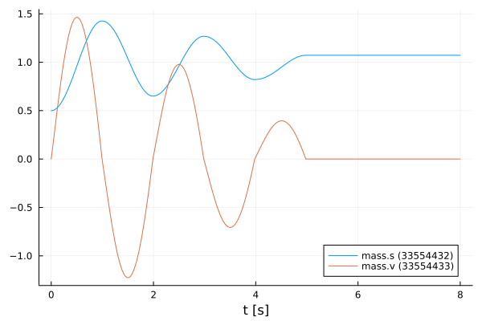
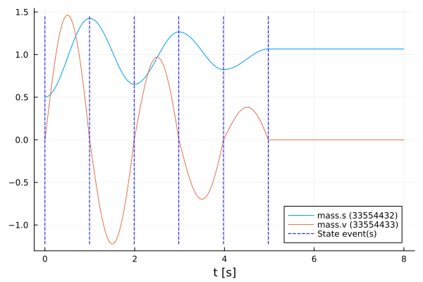

# Simulate an FMU in different modes
Tutorial by Johannes Stoljar, Tobias Thummerer

🚧 This tutorial is under revision and will be replaced by an up-to-date version soon 🚧

## License


```julia
# Copyright (c) 2021 Tobias Thummerer, Lars Mikelsons, Josef Kircher, Johannes Stoljar
# Licensed under the MIT license. 
# See LICENSE (https://github.com/thummeto/FMI.jl/blob/main/LICENSE) file in the project root for details.
```

## Motivation
This Julia Package *FMI.jl* is motivated by the use of simulation models in Julia. Here the FMI specification is implemented. FMI (*Functional Mock-up Interface*) is a free standard ([fmi-standard.org](https://fmi-standard.org/)) that defines a container and an interface to exchange dynamic models using a combination of XML files, binaries and C code zipped into a single file. The user can thus use simulation models in the form of an FMU (*Functional Mock-up Units*). Besides loading the FMU, the user can also set values for parameters and states and simulate the FMU both as co-simulation and model exchange simulation.

## Introduction to the example
In this example we want to show how fast and easy the simulation for an FMU is. For this purpose, the FMU is simulated in co-simulation mode and in model-exchange mode. After the FMU has been simulated, the simulation results are displayed in a graph. The graphs of the different modes are compared with each other. The used model is a one-dimensional spring pendulum with friction. The object-orientated structure of the *SpringFrictionPendulum1D* can be seen in the following graphic.

  


## Target group
The example is primarily intended for users who work in the field of simulations. The example wants to show how simple it is to use FMUs in Julia.


## Other formats
Besides, this [Jupyter Notebook](https://github.com/thummeto/FMI.jl/blob/examples/examples/src/simulate.ipynb) there is also a [Julia file](https://github.com/thummeto/FMI.jl/blob/examples/examples/src/simulate.jl) with the same name, which contains only the code cells and for the documentation there is a [Markdown file](https://github.com/thummeto/FMI.jl/blob/examples/examples/src/simulate.md) corresponding to the notebook.  


## Getting started

### Installation prerequisites
|     | Description                       | Command                   | Alternative                                    |   
|:----|:----------------------------------|:--------------------------|:-----------------------------------------------|
| 1.  | Enter Package Manager via         | ]                         |                                                |
| 2.  | Install FMI via                   | add FMI                   | add " https://github.com/ThummeTo/FMI.jl "     |
| 3.  | Install FMIZoo via                | add FMIZoo                | add " https://github.com/ThummeTo/FMIZoo.jl "  |
| 4.  | Install Plots via                 | add Plots                 |                                                |

## Code section

To run the example, the previously installed packages must be included. 


```julia
# imports
using FMI
using FMIZoo
using Plots
using DifferentialEquations
```

    ┌ Warning: Circular dependency detected. Precompilation will be skipped for:
    │   NonlinearSolveBaseSparseMatrixColoringsExt [e3ecd195-ca82-5397-9546-f380c1e34951]
    │   DiffEqBaseChainRulesCoreExt [b00db79b-61e3-50fb-b26f-2d35b2d9e4ed]
    │   Transducers [28d57a85-8fef-5791-bfe6-a80928e7c999]
    │   NonlinearSolve [8913a72c-1f9b-4ce2-8d82-65094dcecaec]
    │   OrdinaryDiffEq [1dea7af3-3e70-54e6-95c3-0bf5283fa5ed]
    │   DifferentialEquationsFMIExt [232470a1-1d28-551b-8e3b-d6141e70703a]
    │   NonlinearSolveBaseForwardDiffExt [63d416d0-6995-5965-81e0-55251226d976]
    │   Folds [41a02a25-b8f0-4f67-bc48-60067656b558]
    │   LineSearchLineSearchesExt [8d20b31a-8b56-511a-b573-0bef60e8c8c7]
    │   NonlinearSolveBandedMatricesExt [8800daa3-e725-5fa8-982f-091420a833d6]
    │   OrdinaryDiffEqFunctionMap [d3585ca7-f5d3-4ba6-8057-292ed1abd90f]
    │   LinearSolveEnzymeExt [133222a9-3015-5ee0-8b28-65fc8ed13c28]
    │   OrdinaryDiffEqLinear [521117fe-8c41-49f8-b3b6-30780b3f0fb5]
    │   OrdinaryDiffEqTsit5 [b1df2697-797e-41e3-8120-5422d3b24e4a]
    │   TestExt [62af87b3-b810-57d2-b7eb-8929911df373]
    │   OrdinaryDiffEqBDF [6ad6398a-0878-4a85-9266-38940aa047c8]
    │   StaticArraysExt [6207fee4-2535-5e24-a3ba-6518da1c7d2a]
    │   SparseDiffTools [47a9eef4-7e08-11e9-0b38-333d64bd3804]
    │   OrdinaryDiffEqPRK [5b33eab2-c0f1-4480-b2c3-94bc1e80bda1]
    │   OrdinaryDiffEqDefault [50262376-6c5a-4cf5-baba-aaf4f84d72d7]
    │   BoundaryValueDiffEqShooting [ed55bfe0-3725-4db6-871e-a1dc9f42a757]
    │   OrdinaryDiffEqRosenbrock [43230ef6-c299-4910-a778-202eb28ce4ce]
    │   JumpProcesses [ccbc3e58-028d-4f4c-8cd5-9ae44345cda5]
    │   SteadyStateDiffEq [9672c7b4-1e72-59bd-8a11-6ac3964bc41f]
    │   OrdinaryDiffEqAdamsBashforthMoulton [89bda076-bce5-4f1c-845f-551c83cdda9a]
    │   OrdinaryDiffEqExplicitRK [9286f039-9fbf-40e8-bf65-aa933bdc4db0]
    │   OrdinaryDiffEqCore [bbf590c4-e513-4bbe-9b18-05decba2e5d8]
    │   OrdinaryDiffEqCoreEnzymeCoreExt [ca1c724a-f4aa-55ef-b8e4-2f05449449ac]
    │   OrdinaryDiffEqPDIRK [5dd0a6cf-3d4b-4314-aa06-06d4e299bc89]
    │   MATExt [5e726ecd-5b00-51ec-bc99-f7ee9de03178]
    │   NonlinearSolveNLsolveExt [ae262b1c-8c8a-50b1-9ef3-b8fcfb893e74]
    │   OrdinaryDiffEqStabilizedRK [358294b1-0aab-51c3-aafe-ad5ab194a2ad]
    │   OrdinaryDiffEqSSPRK [669c94d9-1f4b-4b64-b377-1aa079aa2388]
    │   DelayDiffEq [bcd4f6db-9728-5f36-b5f7-82caef46ccdb]
    │   DifferentialEquations [0c46a032-eb83-5123-abaf-570d42b7fbaa]
    │   NonlinearSolveBaseSparseArraysExt [8494477e-8a74-521a-b11a-5a22161b1bc8]
    │   PlotsExt [e73c9e8f-3556-58c3-b67e-c4596fa67ff1]
    │   LinearSolveBandedMatricesExt [9522afde-9e86-5396-abc8-24b7312356fe]
    │   BoundaryValueDiffEqFIRK [85d9eb09-370e-4000-bb32-543851f73618]
    │   BoundaryValueDiffEqMIRK [1a22d4ce-7765-49ea-b6f2-13c8438986a6]
    │   OrdinaryDiffEqRKN [af6ede74-add8-4cfd-b1df-9a4dbb109d7a]
    │   LinearSolve [7ed4a6bd-45f5-4d41-b270-4a48e9bafcae]
    │   OrdinaryDiffEqQPRK [04162be5-8125-4266-98ed-640baecc6514]
    │   RecursiveArrayToolsForwardDiffExt [14203109-85fb-5f77-af23-1cb7d9032242]
    │   DiffEqBaseSparseArraysExt [4131c53f-b1d6-5635-a7a3-57f6f930b644]
    │   TransducersLazyArraysExt [cdbecb60-77cf-500a-86c2-8d8bbf22df88]
    │   NonlinearSolveBaseBandedMatricesExt [f3d6eb4f-59b9-5696-a638-eddf66c7554e]
    │   NonlinearSolveFirstOrder [5959db7a-ea39-4486-b5fe-2dd0bf03d60d]
    │   SciMLOperatorsStaticArraysCoreExt [a2df0a61-553a-563b-aed7-0ce21874eb58]
    │   Sundials [c3572dad-4567-51f8-b174-8c6c989267f4]
    │   RecursiveArrayToolsFastBroadcastExt [42296aa8-c874-5f57-b5c1-8d6f5ebd5400]
    │   SciMLBase [0bca4576-84f4-4d90-8ffe-ffa030f20462]
    │   ForwardDiffExt [92c717c9-c1e5-53c1-ac59-0de8aab6796e]
    │   LinearSolveFastAlmostBandedMatricesExt [f94f2e43-4c39-5f8d-ab9c-7017feb07ff4]
    │   OrdinaryDiffEqHighOrderRK [d28bc4f8-55e1-4f49-af69-84c1a99f0f58]
    │   OrdinaryDiffEqLowStorageRK [b0944070-b475-4768-8dec-fb6eb410534d]
    │   OrdinaryDiffEqSymplecticRK [fa646aed-7ef9-47eb-84c4-9443fc8cbfa8]
    │   OrdinaryDiffEqStabilizedIRK [e3e12d00-db14-5390-b879-ac3dd2ef6296]
    │   FMIImport [9fcbc62e-52a0-44e9-a616-1359a0008194]
    │   OrdinaryDiffEqLowOrderRK [1344f307-1e59-4825-a18e-ace9aa3fa4c6]
    │   OrdinaryDiffEqExponentialRK [e0540318-69ee-4070-8777-9e2de6de23de]
    │   OrdinaryDiffEqDifferentiation [4302a76b-040a-498a-8c04-15b101fed76b]
    │   OrdinaryDiffEqNonlinearSolve [127b3ac7-2247-4354-8eb6-78cf4e7c58e8]
    │   SparseDiffToolsPolyesterExt [9f049cbb-7c7d-5dfe-91f7-cf323d5306ff]
    │   OrdinaryDiffEqSDIRK [2d112036-d095-4a1e-ab9a-08536f3ecdbf]
    │   LinearAlgebraExt [ef8e1453-9c17-56fe-886b-405471570bc8]
    │   LineSearch [87fe0de2-c867-4266-b59a-2f0a94fc965b]
    │   SciMLBaseChainRulesCoreExt [4676cac9-c8e0-5d6e-a4e0-e3351593cdf5]
    │   OrdinaryDiffEqExtrapolation [becaefa8-8ca2-5cf9-886d-c06f3d2bd2c4]
    │   OrdinaryDiffEqVerner [79d7bb75-1356-48c1-b8c0-6832512096c2]
    │   SimpleNonlinearSolveChainRulesCoreExt [073a8d7d-86ee-5d75-9348-f9bf6155b014]
    │   DiffEqCallbacks [459566f4-90b8-5000-8ac3-15dfb0a30def]
    │   FMI [14a09403-18e3-468f-ad8a-74f8dda2d9ac]
    │   BangBang [198e06fe-97b7-11e9-32a5-e1d131e6ad66]
    │   DiffEqBaseDistributionsExt [24f3332a-0dc5-5d65-94b6-25e75cab9690]
    │   SciMLOperators [c0aeaf25-5076-4817-a8d5-81caf7dfa961]
    │   FMIBase [900ee838-d029-460e-b485-d98a826ceef2]
    │   RecursiveArrayTools [731186ca-8d62-57ce-b412-fbd966d074cd]
    │   FMIExport [31b88311-cab6-44ed-ba9c-fe5a9abbd67a]
    │   BoundaryValueDiffEqCore [56b672f2-a5fe-4263-ab2d-da677488eb3a]
    │   OrdinaryDiffEqFeagin [101fe9f7-ebb6-4678-b671-3a81e7194747]
    │   StochasticDiffEq [789caeaf-c7a9-5a7d-9973-96adeb23e2a0]
    │   DiffEqBase [2b5f629d-d688-5b77-993f-72d75c75574e]
    │   BangBangStaticArraysExt [a9f1882a-14fa-573e-a12d-824431257a23]
    │   FMIZooExt [0fe4e21f-c175-5a0f-899f-abb2d776b1a2]
    │   RecursiveArrayToolsSparseArraysExt [73e54eaf-3344-511d-b088-1ac5413eca63]
    │   BangBangChainRulesCoreExt [47e8a63d-7df8-5da4-81a4-8f5796ea640c]
    │   LinearSolveRecursiveArrayToolsExt [04950c4b-5bc4-5740-952d-02d2c1eb583a]
    │   TransducersReferenceablesExt [befac7fd-b390-5150-b72a-6269c65d7e1f]
    │   SciMLJacobianOperators [19f34311-ddf3-4b8b-af20-060888a46c0e]
    │   NonlinearSolveBaseLineSearchExt [a65b7766-7c26-554a-8b8d-165d7f96f890]
    │   DiffEqNoiseProcess [77a26b50-5914-5dd7-bc55-306e6241c503]
    │   TransducersAdaptExt [9144d9d9-84fa-5f34-a63a-3acddca89462]
    │   DiffEqBaseUnitfulExt [aeb06bb4-539b-5a1b-8332-034ed9f8ca66]
    │   UnitfulExt [8d0556db-720e-519a-baed-0b9ed79749be]
    │   NonlinearSolveBaseLinearSolveExt [3d4538b4-647b-544e-b0c2-b52d0495c932]
    │   OrdinaryDiffEqNordsieck [c9986a66-5c92-4813-8696-a7ec84c806c8]
    │   OrdinaryDiffEqFIRK [5960d6e9-dd7a-4743-88e7-cf307b64f125]
    │   NonlinearSolveBaseDiffEqBaseExt [a0bd8381-04c7-5287-82b0-0bf1e59008be]
    │   SimpleNonlinearSolve [727e6d20-b764-4bd8-a329-72de5adea6c7]
    │   NonlinearSolveBase [be0214bd-f91f-a760-ac4e-3421ce2b2da0]
    │   OrdinaryDiffEqIMEXMultistep [9f002381-b378-40b7-97a6-27a27c83f129]
    │   MicroCollections [128add7d-3638-4c79-886c-908ea0c25c34]
    │   SymbolicIndexingInterface [2efcf032-c050-4f8e-a9bb-153293bab1f5]
    │   DatesExt [0361c7f5-3687-5641-8bd2-a1de0c64d1ed]
    │   SciMLOperatorsSparseArraysExt [9985400b-97ec-5583-b534-4f70b643bcf7]
    │   BoundaryValueDiffEq [764a87c0-6b3e-53db-9096-fe964310641d]
    │   BangBangTablesExt [476361b5-ac10-5c09-8bec-30d098a22a5b]
    └ @ Pkg.API C:\hostedtoolcache\windows\julia\1.10.7\x64\share\julia\stdlib\v1.10\Pkg\src\API.jl:1279
    

    [ Info: Precompiling FMI [14a09403-18e3-468f-ad8a-74f8dda2d9ac]
    

    ┌ Warning: Module DatesExt with build ID ffffffff-ffff-ffff-0000-013022a8647d is missing from the cache.
    │ This may mean DatesExt [0361c7f5-3687-5641-8bd2-a1de0c64d1ed] does not support precompilation but is imported by a module that does.
    └ @ Base loading.jl:2011
    

    ┌ Error: Error during loading of extension DatesExt of Accessors, use `Base.retry_load_extensions()` to retry.
    │   exception =
    │    1-element ExceptionStack:
    │    Declaring __precompile__(false) is not allowed in files that are being precompiled.
    │    Stacktrace:
    │      [1] _require(pkg::Base.PkgId, env::Nothing)
    │        @ Base .\loading.jl:2015
    │      [2] __require_prelocked(uuidkey::Base.PkgId, env::Nothing)
    │        @ Base .\loading.jl:1875
    │      [3] #invoke_in_world#3
    │        @ .\essentials.jl:926 [inlined]
    │      [4] invoke_in_world
    │        @ .\essentials.jl:923 [inlined]
    │      [5] _require_prelocked
    │        @ .\loading.jl:1866 [inlined]
    │      [6] _require_prelocked
    │        @ .\loading.jl:1865 [inlined]
    │      [7] run_extension_callbacks(extid::Base.ExtensionId)
    │        @ Base .\loading.jl:1358
    │      [8] run_extension_callbacks(pkgid::Base.PkgId)
    │        @ Base .\loading.jl:1393
    │      [9] run_package_callbacks(modkey::Base.PkgId)
    │        @ Base .\loading.jl:1218
    │     [10] __require_prelocked(uuidkey::Base.PkgId, env::String)
    │        @ Base .\loading.jl:1882
    │     [11] #invoke_in_world#3
    │        @ .\essentials.jl:926 [inlined]
    │     [12] invoke_in_world
    │        @ .\essentials.jl:923 [inlined]
    │     [13] _require_prelocked(uuidkey::Base.PkgId, env::String)
    │        @ Base .\loading.jl:1866
    │     [14] macro expansion
    │        @ .\loading.jl:1853 [inlined]
    │     [15] macro expansion
    │        @ .\lock.jl:267 [inlined]
    │     [16] __require(into::Module, mod::Symbol)
    │        @ Base .\loading.jl:1816
    │     [17] #invoke_in_world#3
    │        @ .\essentials.jl:926 [inlined]
    │     [18] invoke_in_world
    │        @ .\essentials.jl:923 [inlined]
    │     [19] require(into::Module, mod::Symbol)
    │        @ Base .\loading.jl:1809
    │     [20] include
    │        @ .\Base.jl:495 [inlined]
    │     [21] include_package_for_output(pkg::Base.PkgId, input::String, depot_path::Vector{String}, dl_load_path::Vector{String}, load_path::Vector{String}, concrete_deps::Vector{Pair{Base.PkgId, UInt128}}, source::String)
    │        @ Base .\loading.jl:2285
    │     [22] top-level scope
    │        @ stdin:3
    │     [23] eval
    │        @ .\boot.jl:385 [inlined]
    │     [24] include_string(mapexpr::typeof(identity), mod::Module, code::String, filename::String)
    │        @ Base .\loading.jl:2139
    │     [25] include_string
    │        @ .\loading.jl:2149 [inlined]
    │     [26] exec_options(opts::Base.JLOptions)
    │        @ Base .\client.jl:321
    │     [27] _start()
    │        @ Base .\client.jl:557
    └ @ Base loading.jl:1364
    

    ┌ Warning: Circular dependency detected. Precompilation will be skipped for:
    │   NonlinearSolveBaseSparseMatrixColoringsExt [e3ecd195-ca82-5397-9546-f380c1e34951]
    │   DiffEqBaseChainRulesCoreExt [b00db79b-61e3-50fb-b26f-2d35b2d9e4ed]
    │   Transducers [28d57a85-8fef-5791-bfe6-a80928e7c999]
    │   NonlinearSolve [8913a72c-1f9b-4ce2-8d82-65094dcecaec]
    │   OrdinaryDiffEq [1dea7af3-3e70-54e6-95c3-0bf5283fa5ed]
    │   DifferentialEquationsFMIExt [232470a1-1d28-551b-8e3b-d6141e70703a]
    │   NonlinearSolveBaseForwardDiffExt [63d416d0-6995-5965-81e0-55251226d976]
    │   Folds [41a02a25-b8f0-4f67-bc48-60067656b558]
    │   LineSearchLineSearchesExt [8d20b31a-8b56-511a-b573-0bef60e8c8c7]
    │   NonlinearSolveBandedMatricesExt [8800daa3-e725-5fa8-982f-091420a833d6]
    │   OrdinaryDiffEqFunctionMap [d3585ca7-f5d3-4ba6-8057-292ed1abd90f]
    │   LinearSolveEnzymeExt [133222a9-3015-5ee0-8b28-65fc8ed13c28]
    │   OrdinaryDiffEqLinear [521117fe-8c41-49f8-b3b6-30780b3f0fb5]
    │   OrdinaryDiffEqTsit5 [b1df2697-797e-41e3-8120-5422d3b24e4a]
    │   TestExt [62af87b3-b810-57d2-b7eb-8929911df373]
    │   OrdinaryDiffEqBDF [6ad6398a-0878-4a85-9266-38940aa047c8]
    │   StaticArraysExt [6207fee4-2535-5e24-a3ba-6518da1c7d2a]
    │   SparseDiffTools [47a9eef4-7e08-11e9-0b38-333d64bd3804]
    │   OrdinaryDiffEqPRK [5b33eab2-c0f1-4480-b2c3-94bc1e80bda1]
    │   OrdinaryDiffEqDefault [50262376-6c5a-4cf5-baba-aaf4f84d72d7]
    │   BoundaryValueDiffEqShooting [ed55bfe0-3725-4db6-871e-a1dc9f42a757]
    │   OrdinaryDiffEqRosenbrock [43230ef6-c299-4910-a778-202eb28ce4ce]
    │   JumpProcesses [ccbc3e58-028d-4f4c-8cd5-9ae44345cda5]
    │   SteadyStateDiffEq [9672c7b4-1e72-59bd-8a11-6ac3964bc41f]
    │   OrdinaryDiffEqAdamsBashforthMoulton [89bda076-bce5-4f1c-845f-551c83cdda9a]
    │   OrdinaryDiffEqExplicitRK [9286f039-9fbf-40e8-bf65-aa933bdc4db0]
    │   OrdinaryDiffEqCore [bbf590c4-e513-4bbe-9b18-05decba2e5d8]
    │   OrdinaryDiffEqCoreEnzymeCoreExt [ca1c724a-f4aa-55ef-b8e4-2f05449449ac]
    │   OrdinaryDiffEqPDIRK [5dd0a6cf-3d4b-4314-aa06-06d4e299bc89]
    │   MATExt [5e726ecd-5b00-51ec-bc99-f7ee9de03178]
    │   NonlinearSolveNLsolveExt [ae262b1c-8c8a-50b1-9ef3-b8fcfb893e74]
    │   OrdinaryDiffEqStabilizedRK [358294b1-0aab-51c3-aafe-ad5ab194a2ad]
    │   OrdinaryDiffEqSSPRK [669c94d9-1f4b-4b64-b377-1aa079aa2388]
    │   DelayDiffEq [bcd4f6db-9728-5f36-b5f7-82caef46ccdb]
    │   DifferentialEquations [0c46a032-eb83-5123-abaf-570d42b7fbaa]
    │   NonlinearSolveBaseSparseArraysExt [8494477e-8a74-521a-b11a-5a22161b1bc8]
    │   PlotsExt [e73c9e8f-3556-58c3-b67e-c4596fa67ff1]
    │   LinearSolveBandedMatricesExt [9522afde-9e86-5396-abc8-24b7312356fe]
    │   BoundaryValueDiffEqFIRK [85d9eb09-370e-4000-bb32-543851f73618]
    │   BoundaryValueDiffEqMIRK [1a22d4ce-7765-49ea-b6f2-13c8438986a6]
    │   OrdinaryDiffEqRKN [af6ede74-add8-4cfd-b1df-9a4dbb109d7a]
    │   LinearSolve [7ed4a6bd-45f5-4d41-b270-4a48e9bafcae]
    │   OrdinaryDiffEqQPRK [04162be5-8125-4266-98ed-640baecc6514]
    │   RecursiveArrayToolsForwardDiffExt [14203109-85fb-5f77-af23-1cb7d9032242]
    │   DiffEqBaseSparseArraysExt [4131c53f-b1d6-5635-a7a3-57f6f930b644]
    │   TransducersLazyArraysExt [cdbecb60-77cf-500a-86c2-8d8bbf22df88]
    │   NonlinearSolveBaseBandedMatricesExt [f3d6eb4f-59b9-5696-a638-eddf66c7554e]
    │   NonlinearSolveFirstOrder [5959db7a-ea39-4486-b5fe-2dd0bf03d60d]
    │   SciMLOperatorsStaticArraysCoreExt [a2df0a61-553a-563b-aed7-0ce21874eb58]
    │   Sundials [c3572dad-4567-51f8-b174-8c6c989267f4]
    │   RecursiveArrayToolsFastBroadcastExt [42296aa8-c874-5f57-b5c1-8d6f5ebd5400]
    │   SciMLBase [0bca4576-84f4-4d90-8ffe-ffa030f20462]
    │   ForwardDiffExt [92c717c9-c1e5-53c1-ac59-0de8aab6796e]
    │   LinearSolveFastAlmostBandedMatricesExt [f94f2e43-4c39-5f8d-ab9c-7017feb07ff4]
    │   OrdinaryDiffEqHighOrderRK [d28bc4f8-55e1-4f49-af69-84c1a99f0f58]
    │   OrdinaryDiffEqLowStorageRK [b0944070-b475-4768-8dec-fb6eb410534d]
    │   OrdinaryDiffEqSymplecticRK [fa646aed-7ef9-47eb-84c4-9443fc8cbfa8]
    │   OrdinaryDiffEqStabilizedIRK [e3e12d00-db14-5390-b879-ac3dd2ef6296]
    │   FMIImport [9fcbc62e-52a0-44e9-a616-1359a0008194]
    │   OrdinaryDiffEqLowOrderRK [1344f307-1e59-4825-a18e-ace9aa3fa4c6]
    │   OrdinaryDiffEqExponentialRK [e0540318-69ee-4070-8777-9e2de6de23de]
    │   OrdinaryDiffEqDifferentiation [4302a76b-040a-498a-8c04-15b101fed76b]
    │   OrdinaryDiffEqNonlinearSolve [127b3ac7-2247-4354-8eb6-78cf4e7c58e8]
    │   SparseDiffToolsPolyesterExt [9f049cbb-7c7d-5dfe-91f7-cf323d5306ff]
    │   OrdinaryDiffEqSDIRK [2d112036-d095-4a1e-ab9a-08536f3ecdbf]
    │   LinearAlgebraExt [ef8e1453-9c17-56fe-886b-405471570bc8]
    │   LineSearch [87fe0de2-c867-4266-b59a-2f0a94fc965b]
    │   SciMLBaseChainRulesCoreExt [4676cac9-c8e0-5d6e-a4e0-e3351593cdf5]
    │   OrdinaryDiffEqExtrapolation [becaefa8-8ca2-5cf9-886d-c06f3d2bd2c4]
    │   OrdinaryDiffEqVerner [79d7bb75-1356-48c1-b8c0-6832512096c2]
    │   SimpleNonlinearSolveChainRulesCoreExt [073a8d7d-86ee-5d75-9348-f9bf6155b014]
    │   DiffEqCallbacks [459566f4-90b8-5000-8ac3-15dfb0a30def]
    │   FMI [14a09403-18e3-468f-ad8a-74f8dda2d9ac]
    │   BangBang [198e06fe-97b7-11e9-32a5-e1d131e6ad66]
    │   DiffEqBaseDistributionsExt [24f3332a-0dc5-5d65-94b6-25e75cab9690]
    │   SciMLOperators [c0aeaf25-5076-4817-a8d5-81caf7dfa961]
    │   FMIBase [900ee838-d029-460e-b485-d98a826ceef2]
    │   RecursiveArrayTools [731186ca-8d62-57ce-b412-fbd966d074cd]
    │   FMIExport [31b88311-cab6-44ed-ba9c-fe5a9abbd67a]
    │   BoundaryValueDiffEqCore [56b672f2-a5fe-4263-ab2d-da677488eb3a]
    │   OrdinaryDiffEqFeagin [101fe9f7-ebb6-4678-b671-3a81e7194747]
    │   StochasticDiffEq [789caeaf-c7a9-5a7d-9973-96adeb23e2a0]
    │   DiffEqBase [2b5f629d-d688-5b77-993f-72d75c75574e]
    │   BangBangStaticArraysExt [a9f1882a-14fa-573e-a12d-824431257a23]
    │   FMIZooExt [0fe4e21f-c175-5a0f-899f-abb2d776b1a2]
    │   RecursiveArrayToolsSparseArraysExt [73e54eaf-3344-511d-b088-1ac5413eca63]
    │   BangBangChainRulesCoreExt [47e8a63d-7df8-5da4-81a4-8f5796ea640c]
    │   LinearSolveRecursiveArrayToolsExt [04950c4b-5bc4-5740-952d-02d2c1eb583a]
    │   TransducersReferenceablesExt [befac7fd-b390-5150-b72a-6269c65d7e1f]
    │   SciMLJacobianOperators [19f34311-ddf3-4b8b-af20-060888a46c0e]
    │   NonlinearSolveBaseLineSearchExt [a65b7766-7c26-554a-8b8d-165d7f96f890]
    │   DiffEqNoiseProcess [77a26b50-5914-5dd7-bc55-306e6241c503]
    │   TransducersAdaptExt [9144d9d9-84fa-5f34-a63a-3acddca89462]
    │   DiffEqBaseUnitfulExt [aeb06bb4-539b-5a1b-8332-034ed9f8ca66]
    │   UnitfulExt [8d0556db-720e-519a-baed-0b9ed79749be]
    │   NonlinearSolveBaseLinearSolveExt [3d4538b4-647b-544e-b0c2-b52d0495c932]
    │   OrdinaryDiffEqNordsieck [c9986a66-5c92-4813-8696-a7ec84c806c8]
    │   OrdinaryDiffEqFIRK [5960d6e9-dd7a-4743-88e7-cf307b64f125]
    │   NonlinearSolveBaseDiffEqBaseExt [a0bd8381-04c7-5287-82b0-0bf1e59008be]
    │   SimpleNonlinearSolve [727e6d20-b764-4bd8-a329-72de5adea6c7]
    │   NonlinearSolveBase [be0214bd-f91f-a760-ac4e-3421ce2b2da0]
    │   OrdinaryDiffEqIMEXMultistep [9f002381-b378-40b7-97a6-27a27c83f129]
    │   MicroCollections [128add7d-3638-4c79-886c-908ea0c25c34]
    │   SymbolicIndexingInterface [2efcf032-c050-4f8e-a9bb-153293bab1f5]
    │   DatesExt [0361c7f5-3687-5641-8bd2-a1de0c64d1ed]
    │   SciMLOperatorsSparseArraysExt [9985400b-97ec-5583-b534-4f70b643bcf7]
    │   BoundaryValueDiffEq [764a87c0-6b3e-53db-9096-fe964310641d]
    │   BangBangTablesExt [476361b5-ac10-5c09-8bec-30d098a22a5b]
    └ @ Pkg.API C:\hostedtoolcache\windows\julia\1.10.7\x64\share\julia\stdlib\v1.10\Pkg\src\API.jl:1279
    

    [ Info: Precompiling MATExt [5e726ecd-5b00-51ec-bc99-f7ee9de03178]
    

    ┌ Warning: Circular dependency detected. Precompilation will be skipped for:
    │   NonlinearSolveBaseSparseMatrixColoringsExt [e3ecd195-ca82-5397-9546-f380c1e34951]
    │   DiffEqBaseChainRulesCoreExt [b00db79b-61e3-50fb-b26f-2d35b2d9e4ed]
    │   Transducers [28d57a85-8fef-5791-bfe6-a80928e7c999]
    │   NonlinearSolve [8913a72c-1f9b-4ce2-8d82-65094dcecaec]
    │   OrdinaryDiffEq [1dea7af3-3e70-54e6-95c3-0bf5283fa5ed]
    │   DifferentialEquationsFMIExt [232470a1-1d28-551b-8e3b-d6141e70703a]
    │   NonlinearSolveBaseForwardDiffExt [63d416d0-6995-5965-81e0-55251226d976]
    │   Folds [41a02a25-b8f0-4f67-bc48-60067656b558]
    │   LineSearchLineSearchesExt [8d20b31a-8b56-511a-b573-0bef60e8c8c7]
    │   NonlinearSolveBandedMatricesExt [8800daa3-e725-5fa8-982f-091420a833d6]
    │   OrdinaryDiffEqFunctionMap [d3585ca7-f5d3-4ba6-8057-292ed1abd90f]
    │   LinearSolveEnzymeExt [133222a9-3015-5ee0-8b28-65fc8ed13c28]
    │   OrdinaryDiffEqLinear [521117fe-8c41-49f8-b3b6-30780b3f0fb5]
    │   OrdinaryDiffEqTsit5 [b1df2697-797e-41e3-8120-5422d3b24e4a]
    │   TestExt [62af87b3-b810-57d2-b7eb-8929911df373]
    │   OrdinaryDiffEqBDF [6ad6398a-0878-4a85-9266-38940aa047c8]
    │   StaticArraysExt [6207fee4-2535-5e24-a3ba-6518da1c7d2a]
    │   SparseDiffTools [47a9eef4-7e08-11e9-0b38-333d64bd3804]
    │   OrdinaryDiffEqPRK [5b33eab2-c0f1-4480-b2c3-94bc1e80bda1]
    │   OrdinaryDiffEqDefault [50262376-6c5a-4cf5-baba-aaf4f84d72d7]
    │   BoundaryValueDiffEqShooting [ed55bfe0-3725-4db6-871e-a1dc9f42a757]
    │   OrdinaryDiffEqRosenbrock [43230ef6-c299-4910-a778-202eb28ce4ce]
    │   JumpProcesses [ccbc3e58-028d-4f4c-8cd5-9ae44345cda5]
    │   SteadyStateDiffEq [9672c7b4-1e72-59bd-8a11-6ac3964bc41f]
    │   OrdinaryDiffEqAdamsBashforthMoulton [89bda076-bce5-4f1c-845f-551c83cdda9a]
    │   OrdinaryDiffEqExplicitRK [9286f039-9fbf-40e8-bf65-aa933bdc4db0]
    │   OrdinaryDiffEqCore [bbf590c4-e513-4bbe-9b18-05decba2e5d8]
    │   OrdinaryDiffEqCoreEnzymeCoreExt [ca1c724a-f4aa-55ef-b8e4-2f05449449ac]
    │   OrdinaryDiffEqPDIRK [5dd0a6cf-3d4b-4314-aa06-06d4e299bc89]
    │   MATExt [5e726ecd-5b00-51ec-bc99-f7ee9de03178]
    │   NonlinearSolveNLsolveExt [ae262b1c-8c8a-50b1-9ef3-b8fcfb893e74]
    │   OrdinaryDiffEqStabilizedRK [358294b1-0aab-51c3-aafe-ad5ab194a2ad]
    │   OrdinaryDiffEqSSPRK [669c94d9-1f4b-4b64-b377-1aa079aa2388]
    │   DelayDiffEq [bcd4f6db-9728-5f36-b5f7-82caef46ccdb]
    │   DifferentialEquations [0c46a032-eb83-5123-abaf-570d42b7fbaa]
    │   NonlinearSolveBaseSparseArraysExt [8494477e-8a74-521a-b11a-5a22161b1bc8]
    │   PlotsExt [e73c9e8f-3556-58c3-b67e-c4596fa67ff1]
    │   LinearSolveBandedMatricesExt [9522afde-9e86-5396-abc8-24b7312356fe]
    │   BoundaryValueDiffEqFIRK [85d9eb09-370e-4000-bb32-543851f73618]
    │   BoundaryValueDiffEqMIRK [1a22d4ce-7765-49ea-b6f2-13c8438986a6]
    │   OrdinaryDiffEqRKN [af6ede74-add8-4cfd-b1df-9a4dbb109d7a]
    │   LinearSolve [7ed4a6bd-45f5-4d41-b270-4a48e9bafcae]
    │   OrdinaryDiffEqQPRK [04162be5-8125-4266-98ed-640baecc6514]
    │   RecursiveArrayToolsForwardDiffExt [14203109-85fb-5f77-af23-1cb7d9032242]
    │   DiffEqBaseSparseArraysExt [4131c53f-b1d6-5635-a7a3-57f6f930b644]
    │   TransducersLazyArraysExt [cdbecb60-77cf-500a-86c2-8d8bbf22df88]
    │   NonlinearSolveBaseBandedMatricesExt [f3d6eb4f-59b9-5696-a638-eddf66c7554e]
    │   NonlinearSolveFirstOrder [5959db7a-ea39-4486-b5fe-2dd0bf03d60d]
    │   SciMLOperatorsStaticArraysCoreExt [a2df0a61-553a-563b-aed7-0ce21874eb58]
    │   Sundials [c3572dad-4567-51f8-b174-8c6c989267f4]
    │   RecursiveArrayToolsFastBroadcastExt [42296aa8-c874-5f57-b5c1-8d6f5ebd5400]
    │   SciMLBase [0bca4576-84f4-4d90-8ffe-ffa030f20462]
    │   ForwardDiffExt [92c717c9-c1e5-53c1-ac59-0de8aab6796e]
    │   LinearSolveFastAlmostBandedMatricesExt [f94f2e43-4c39-5f8d-ab9c-7017feb07ff4]
    │   OrdinaryDiffEqHighOrderRK [d28bc4f8-55e1-4f49-af69-84c1a99f0f58]
    │   OrdinaryDiffEqLowStorageRK [b0944070-b475-4768-8dec-fb6eb410534d]
    │   OrdinaryDiffEqSymplecticRK [fa646aed-7ef9-47eb-84c4-9443fc8cbfa8]
    │   OrdinaryDiffEqStabilizedIRK [e3e12d00-db14-5390-b879-ac3dd2ef6296]
    │   FMIImport [9fcbc62e-52a0-44e9-a616-1359a0008194]
    │   OrdinaryDiffEqLowOrderRK [1344f307-1e59-4825-a18e-ace9aa3fa4c6]
    │   OrdinaryDiffEqExponentialRK [e0540318-69ee-4070-8777-9e2de6de23de]
    │   OrdinaryDiffEqDifferentiation [4302a76b-040a-498a-8c04-15b101fed76b]
    │   OrdinaryDiffEqNonlinearSolve [127b3ac7-2247-4354-8eb6-78cf4e7c58e8]
    │   SparseDiffToolsPolyesterExt [9f049cbb-7c7d-5dfe-91f7-cf323d5306ff]
    │   OrdinaryDiffEqSDIRK [2d112036-d095-4a1e-ab9a-08536f3ecdbf]
    │   LinearAlgebraExt [ef8e1453-9c17-56fe-886b-405471570bc8]
    │   LineSearch [87fe0de2-c867-4266-b59a-2f0a94fc965b]
    │   SciMLBaseChainRulesCoreExt [4676cac9-c8e0-5d6e-a4e0-e3351593cdf5]
    │   OrdinaryDiffEqExtrapolation [becaefa8-8ca2-5cf9-886d-c06f3d2bd2c4]
    │   OrdinaryDiffEqVerner [79d7bb75-1356-48c1-b8c0-6832512096c2]
    │   SimpleNonlinearSolveChainRulesCoreExt [073a8d7d-86ee-5d75-9348-f9bf6155b014]
    │   DiffEqCallbacks [459566f4-90b8-5000-8ac3-15dfb0a30def]
    │   FMI [14a09403-18e3-468f-ad8a-74f8dda2d9ac]
    │   BangBang [198e06fe-97b7-11e9-32a5-e1d131e6ad66]
    │   DiffEqBaseDistributionsExt [24f3332a-0dc5-5d65-94b6-25e75cab9690]
    │   SciMLOperators [c0aeaf25-5076-4817-a8d5-81caf7dfa961]
    │   FMIBase [900ee838-d029-460e-b485-d98a826ceef2]
    │   RecursiveArrayTools [731186ca-8d62-57ce-b412-fbd966d074cd]
    │   FMIExport [31b88311-cab6-44ed-ba9c-fe5a9abbd67a]
    │   BoundaryValueDiffEqCore [56b672f2-a5fe-4263-ab2d-da677488eb3a]
    │   OrdinaryDiffEqFeagin [101fe9f7-ebb6-4678-b671-3a81e7194747]
    │   StochasticDiffEq [789caeaf-c7a9-5a7d-9973-96adeb23e2a0]
    │   DiffEqBase [2b5f629d-d688-5b77-993f-72d75c75574e]
    │   BangBangStaticArraysExt [a9f1882a-14fa-573e-a12d-824431257a23]
    │   FMIZooExt [0fe4e21f-c175-5a0f-899f-abb2d776b1a2]
    │   RecursiveArrayToolsSparseArraysExt [73e54eaf-3344-511d-b088-1ac5413eca63]
    │   BangBangChainRulesCoreExt [47e8a63d-7df8-5da4-81a4-8f5796ea640c]
    │   LinearSolveRecursiveArrayToolsExt [04950c4b-5bc4-5740-952d-02d2c1eb583a]
    │   TransducersReferenceablesExt [befac7fd-b390-5150-b72a-6269c65d7e1f]
    │   SciMLJacobianOperators [19f34311-ddf3-4b8b-af20-060888a46c0e]
    │   NonlinearSolveBaseLineSearchExt [a65b7766-7c26-554a-8b8d-165d7f96f890]
    │   DiffEqNoiseProcess [77a26b50-5914-5dd7-bc55-306e6241c503]
    │   TransducersAdaptExt [9144d9d9-84fa-5f34-a63a-3acddca89462]
    │   DiffEqBaseUnitfulExt [aeb06bb4-539b-5a1b-8332-034ed9f8ca66]
    │   UnitfulExt [8d0556db-720e-519a-baed-0b9ed79749be]
    │   NonlinearSolveBaseLinearSolveExt [3d4538b4-647b-544e-b0c2-b52d0495c932]
    │   OrdinaryDiffEqNordsieck [c9986a66-5c92-4813-8696-a7ec84c806c8]
    │   OrdinaryDiffEqFIRK [5960d6e9-dd7a-4743-88e7-cf307b64f125]
    │   NonlinearSolveBaseDiffEqBaseExt [a0bd8381-04c7-5287-82b0-0bf1e59008be]
    │   SimpleNonlinearSolve [727e6d20-b764-4bd8-a329-72de5adea6c7]
    │   NonlinearSolveBase [be0214bd-f91f-a760-ac4e-3421ce2b2da0]
    │   OrdinaryDiffEqIMEXMultistep [9f002381-b378-40b7-97a6-27a27c83f129]
    │   MicroCollections [128add7d-3638-4c79-886c-908ea0c25c34]
    │   SymbolicIndexingInterface [2efcf032-c050-4f8e-a9bb-153293bab1f5]
    │   DatesExt [0361c7f5-3687-5641-8bd2-a1de0c64d1ed]
    │   SciMLOperatorsSparseArraysExt [9985400b-97ec-5583-b534-4f70b643bcf7]
    │   BoundaryValueDiffEq [764a87c0-6b3e-53db-9096-fe964310641d]
    │   BangBangTablesExt [476361b5-ac10-5c09-8bec-30d098a22a5b]
    └ @ Pkg.API C:\hostedtoolcache\windows\julia\1.10.7\x64\share\julia\stdlib\v1.10\Pkg\src\API.jl:1279
    [ Info: Precompiling StaticArraysExt [6207fee4-2535-5e24-a3ba-6518da1c7d2a]
    

    ┌ Warning: Circular dependency detected. Precompilation will be skipped for:
    │   NonlinearSolveBaseSparseMatrixColoringsExt [e3ecd195-ca82-5397-9546-f380c1e34951]
    │   DiffEqBaseChainRulesCoreExt [b00db79b-61e3-50fb-b26f-2d35b2d9e4ed]
    │   Transducers [28d57a85-8fef-5791-bfe6-a80928e7c999]
    │   NonlinearSolve [8913a72c-1f9b-4ce2-8d82-65094dcecaec]
    │   OrdinaryDiffEq [1dea7af3-3e70-54e6-95c3-0bf5283fa5ed]
    │   DifferentialEquationsFMIExt [232470a1-1d28-551b-8e3b-d6141e70703a]
    │   NonlinearSolveBaseForwardDiffExt [63d416d0-6995-5965-81e0-55251226d976]
    │   Folds [41a02a25-b8f0-4f67-bc48-60067656b558]
    │   LineSearchLineSearchesExt [8d20b31a-8b56-511a-b573-0bef60e8c8c7]
    │   NonlinearSolveBandedMatricesExt [8800daa3-e725-5fa8-982f-091420a833d6]
    │   OrdinaryDiffEqFunctionMap [d3585ca7-f5d3-4ba6-8057-292ed1abd90f]
    │   LinearSolveEnzymeExt [133222a9-3015-5ee0-8b28-65fc8ed13c28]
    │   OrdinaryDiffEqLinear [521117fe-8c41-49f8-b3b6-30780b3f0fb5]
    │   OrdinaryDiffEqTsit5 [b1df2697-797e-41e3-8120-5422d3b24e4a]
    │   TestExt [62af87b3-b810-57d2-b7eb-8929911df373]
    │   OrdinaryDiffEqBDF [6ad6398a-0878-4a85-9266-38940aa047c8]
    │   StaticArraysExt [6207fee4-2535-5e24-a3ba-6518da1c7d2a]
    │   SparseDiffTools [47a9eef4-7e08-11e9-0b38-333d64bd3804]
    │   OrdinaryDiffEqPRK [5b33eab2-c0f1-4480-b2c3-94bc1e80bda1]
    │   OrdinaryDiffEqDefault [50262376-6c5a-4cf5-baba-aaf4f84d72d7]
    │   BoundaryValueDiffEqShooting [ed55bfe0-3725-4db6-871e-a1dc9f42a757]
    │   OrdinaryDiffEqRosenbrock [43230ef6-c299-4910-a778-202eb28ce4ce]
    │   JumpProcesses [ccbc3e58-028d-4f4c-8cd5-9ae44345cda5]
    │   SteadyStateDiffEq [9672c7b4-1e72-59bd-8a11-6ac3964bc41f]
    │   OrdinaryDiffEqAdamsBashforthMoulton [89bda076-bce5-4f1c-845f-551c83cdda9a]
    │   OrdinaryDiffEqExplicitRK [9286f039-9fbf-40e8-bf65-aa933bdc4db0]
    │   OrdinaryDiffEqCore [bbf590c4-e513-4bbe-9b18-05decba2e5d8]
    │   OrdinaryDiffEqCoreEnzymeCoreExt [ca1c724a-f4aa-55ef-b8e4-2f05449449ac]
    │   OrdinaryDiffEqPDIRK [5dd0a6cf-3d4b-4314-aa06-06d4e299bc89]
    │   MATExt [5e726ecd-5b00-51ec-bc99-f7ee9de03178]
    │   NonlinearSolveNLsolveExt [ae262b1c-8c8a-50b1-9ef3-b8fcfb893e74]
    │   OrdinaryDiffEqStabilizedRK [358294b1-0aab-51c3-aafe-ad5ab194a2ad]
    │   OrdinaryDiffEqSSPRK [669c94d9-1f4b-4b64-b377-1aa079aa2388]
    │   DelayDiffEq [bcd4f6db-9728-5f36-b5f7-82caef46ccdb]
    │   DifferentialEquations [0c46a032-eb83-5123-abaf-570d42b7fbaa]
    │   NonlinearSolveBaseSparseArraysExt [8494477e-8a74-521a-b11a-5a22161b1bc8]
    │   PlotsExt [e73c9e8f-3556-58c3-b67e-c4596fa67ff1]
    │   LinearSolveBandedMatricesExt [9522afde-9e86-5396-abc8-24b7312356fe]
    │   BoundaryValueDiffEqFIRK [85d9eb09-370e-4000-bb32-543851f73618]
    │   BoundaryValueDiffEqMIRK [1a22d4ce-7765-49ea-b6f2-13c8438986a6]
    │   OrdinaryDiffEqRKN [af6ede74-add8-4cfd-b1df-9a4dbb109d7a]
    │   LinearSolve [7ed4a6bd-45f5-4d41-b270-4a48e9bafcae]
    │   OrdinaryDiffEqQPRK [04162be5-8125-4266-98ed-640baecc6514]
    │   RecursiveArrayToolsForwardDiffExt [14203109-85fb-5f77-af23-1cb7d9032242]
    │   DiffEqBaseSparseArraysExt [4131c53f-b1d6-5635-a7a3-57f6f930b644]
    │   TransducersLazyArraysExt [cdbecb60-77cf-500a-86c2-8d8bbf22df88]
    │   NonlinearSolveBaseBandedMatricesExt [f3d6eb4f-59b9-5696-a638-eddf66c7554e]
    │   NonlinearSolveFirstOrder [5959db7a-ea39-4486-b5fe-2dd0bf03d60d]
    │   SciMLOperatorsStaticArraysCoreExt [a2df0a61-553a-563b-aed7-0ce21874eb58]
    │   Sundials [c3572dad-4567-51f8-b174-8c6c989267f4]
    │   RecursiveArrayToolsFastBroadcastExt [42296aa8-c874-5f57-b5c1-8d6f5ebd5400]
    │   SciMLBase [0bca4576-84f4-4d90-8ffe-ffa030f20462]
    │   ForwardDiffExt [92c717c9-c1e5-53c1-ac59-0de8aab6796e]
    │   LinearSolveFastAlmostBandedMatricesExt [f94f2e43-4c39-5f8d-ab9c-7017feb07ff4]
    │   OrdinaryDiffEqHighOrderRK [d28bc4f8-55e1-4f49-af69-84c1a99f0f58]
    │   OrdinaryDiffEqLowStorageRK [b0944070-b475-4768-8dec-fb6eb410534d]
    │   OrdinaryDiffEqSymplecticRK [fa646aed-7ef9-47eb-84c4-9443fc8cbfa8]
    │   OrdinaryDiffEqStabilizedIRK [e3e12d00-db14-5390-b879-ac3dd2ef6296]
    │   FMIImport [9fcbc62e-52a0-44e9-a616-1359a0008194]
    │   OrdinaryDiffEqLowOrderRK [1344f307-1e59-4825-a18e-ace9aa3fa4c6]
    │   OrdinaryDiffEqExponentialRK [e0540318-69ee-4070-8777-9e2de6de23de]
    │   OrdinaryDiffEqDifferentiation [4302a76b-040a-498a-8c04-15b101fed76b]
    │   OrdinaryDiffEqNonlinearSolve [127b3ac7-2247-4354-8eb6-78cf4e7c58e8]
    │   SparseDiffToolsPolyesterExt [9f049cbb-7c7d-5dfe-91f7-cf323d5306ff]
    │   OrdinaryDiffEqSDIRK [2d112036-d095-4a1e-ab9a-08536f3ecdbf]
    │   LinearAlgebraExt [ef8e1453-9c17-56fe-886b-405471570bc8]
    │   LineSearch [87fe0de2-c867-4266-b59a-2f0a94fc965b]
    │   SciMLBaseChainRulesCoreExt [4676cac9-c8e0-5d6e-a4e0-e3351593cdf5]
    │   OrdinaryDiffEqExtrapolation [becaefa8-8ca2-5cf9-886d-c06f3d2bd2c4]
    │   OrdinaryDiffEqVerner [79d7bb75-1356-48c1-b8c0-6832512096c2]
    │   SimpleNonlinearSolveChainRulesCoreExt [073a8d7d-86ee-5d75-9348-f9bf6155b014]
    │   DiffEqCallbacks [459566f4-90b8-5000-8ac3-15dfb0a30def]
    │   FMI [14a09403-18e3-468f-ad8a-74f8dda2d9ac]
    │   BangBang [198e06fe-97b7-11e9-32a5-e1d131e6ad66]
    │   DiffEqBaseDistributionsExt [24f3332a-0dc5-5d65-94b6-25e75cab9690]
    │   SciMLOperators [c0aeaf25-5076-4817-a8d5-81caf7dfa961]
    │   FMIBase [900ee838-d029-460e-b485-d98a826ceef2]
    │   RecursiveArrayTools [731186ca-8d62-57ce-b412-fbd966d074cd]
    │   FMIExport [31b88311-cab6-44ed-ba9c-fe5a9abbd67a]
    │   BoundaryValueDiffEqCore [56b672f2-a5fe-4263-ab2d-da677488eb3a]
    │   OrdinaryDiffEqFeagin [101fe9f7-ebb6-4678-b671-3a81e7194747]
    │   StochasticDiffEq [789caeaf-c7a9-5a7d-9973-96adeb23e2a0]
    │   DiffEqBase [2b5f629d-d688-5b77-993f-72d75c75574e]
    │   BangBangStaticArraysExt [a9f1882a-14fa-573e-a12d-824431257a23]
    │   FMIZooExt [0fe4e21f-c175-5a0f-899f-abb2d776b1a2]
    │   RecursiveArrayToolsSparseArraysExt [73e54eaf-3344-511d-b088-1ac5413eca63]
    │   BangBangChainRulesCoreExt [47e8a63d-7df8-5da4-81a4-8f5796ea640c]
    │   LinearSolveRecursiveArrayToolsExt [04950c4b-5bc4-5740-952d-02d2c1eb583a]
    │   TransducersReferenceablesExt [befac7fd-b390-5150-b72a-6269c65d7e1f]
    │   SciMLJacobianOperators [19f34311-ddf3-4b8b-af20-060888a46c0e]
    │   NonlinearSolveBaseLineSearchExt [a65b7766-7c26-554a-8b8d-165d7f96f890]
    │   DiffEqNoiseProcess [77a26b50-5914-5dd7-bc55-306e6241c503]
    │   TransducersAdaptExt [9144d9d9-84fa-5f34-a63a-3acddca89462]
    │   DiffEqBaseUnitfulExt [aeb06bb4-539b-5a1b-8332-034ed9f8ca66]
    │   UnitfulExt [8d0556db-720e-519a-baed-0b9ed79749be]
    │   NonlinearSolveBaseLinearSolveExt [3d4538b4-647b-544e-b0c2-b52d0495c932]
    │   OrdinaryDiffEqNordsieck [c9986a66-5c92-4813-8696-a7ec84c806c8]
    │   OrdinaryDiffEqFIRK [5960d6e9-dd7a-4743-88e7-cf307b64f125]
    │   NonlinearSolveBaseDiffEqBaseExt [a0bd8381-04c7-5287-82b0-0bf1e59008be]
    │   SimpleNonlinearSolve [727e6d20-b764-4bd8-a329-72de5adea6c7]
    │   NonlinearSolveBase [be0214bd-f91f-a760-ac4e-3421ce2b2da0]
    │   OrdinaryDiffEqIMEXMultistep [9f002381-b378-40b7-97a6-27a27c83f129]
    │   MicroCollections [128add7d-3638-4c79-886c-908ea0c25c34]
    │   SymbolicIndexingInterface [2efcf032-c050-4f8e-a9bb-153293bab1f5]
    │   DatesExt [0361c7f5-3687-5641-8bd2-a1de0c64d1ed]
    │   SciMLOperatorsSparseArraysExt [9985400b-97ec-5583-b534-4f70b643bcf7]
    │   BoundaryValueDiffEq [764a87c0-6b3e-53db-9096-fe964310641d]
    │   BangBangTablesExt [476361b5-ac10-5c09-8bec-30d098a22a5b]
    └ @ Pkg.API C:\hostedtoolcache\windows\julia\1.10.7\x64\share\julia\stdlib\v1.10\Pkg\src\API.jl:1279
    

    [ Info: Precompiling FMIZooExt [0fe4e21f-c175-5a0f-899f-abb2d776b1a2]
    

    ┌ Warning: Circular dependency detected. Precompilation will be skipped for:
    │   NonlinearSolveBaseSparseMatrixColoringsExt [e3ecd195-ca82-5397-9546-f380c1e34951]
    │   DiffEqBaseChainRulesCoreExt [b00db79b-61e3-50fb-b26f-2d35b2d9e4ed]
    │   Transducers [28d57a85-8fef-5791-bfe6-a80928e7c999]
    │   NonlinearSolve [8913a72c-1f9b-4ce2-8d82-65094dcecaec]
    │   OrdinaryDiffEq [1dea7af3-3e70-54e6-95c3-0bf5283fa5ed]
    │   DifferentialEquationsFMIExt [232470a1-1d28-551b-8e3b-d6141e70703a]
    │   NonlinearSolveBaseForwardDiffExt [63d416d0-6995-5965-81e0-55251226d976]
    │   Folds [41a02a25-b8f0-4f67-bc48-60067656b558]
    │   LineSearchLineSearchesExt [8d20b31a-8b56-511a-b573-0bef60e8c8c7]
    │   NonlinearSolveBandedMatricesExt [8800daa3-e725-5fa8-982f-091420a833d6]
    │   OrdinaryDiffEqFunctionMap [d3585ca7-f5d3-4ba6-8057-292ed1abd90f]
    │   LinearSolveEnzymeExt [133222a9-3015-5ee0-8b28-65fc8ed13c28]
    │   OrdinaryDiffEqLinear [521117fe-8c41-49f8-b3b6-30780b3f0fb5]
    │   OrdinaryDiffEqTsit5 [b1df2697-797e-41e3-8120-5422d3b24e4a]
    │   TestExt [62af87b3-b810-57d2-b7eb-8929911df373]
    │   OrdinaryDiffEqBDF [6ad6398a-0878-4a85-9266-38940aa047c8]
    │   StaticArraysExt [6207fee4-2535-5e24-a3ba-6518da1c7d2a]
    │   SparseDiffTools [47a9eef4-7e08-11e9-0b38-333d64bd3804]
    │   OrdinaryDiffEqPRK [5b33eab2-c0f1-4480-b2c3-94bc1e80bda1]
    │   OrdinaryDiffEqDefault [50262376-6c5a-4cf5-baba-aaf4f84d72d7]
    │   BoundaryValueDiffEqShooting [ed55bfe0-3725-4db6-871e-a1dc9f42a757]
    │   OrdinaryDiffEqRosenbrock [43230ef6-c299-4910-a778-202eb28ce4ce]
    │   JumpProcesses [ccbc3e58-028d-4f4c-8cd5-9ae44345cda5]
    │   SteadyStateDiffEq [9672c7b4-1e72-59bd-8a11-6ac3964bc41f]
    │   OrdinaryDiffEqAdamsBashforthMoulton [89bda076-bce5-4f1c-845f-551c83cdda9a]
    │   OrdinaryDiffEqExplicitRK [9286f039-9fbf-40e8-bf65-aa933bdc4db0]
    │   OrdinaryDiffEqCore [bbf590c4-e513-4bbe-9b18-05decba2e5d8]
    │   OrdinaryDiffEqCoreEnzymeCoreExt [ca1c724a-f4aa-55ef-b8e4-2f05449449ac]
    │   OrdinaryDiffEqPDIRK [5dd0a6cf-3d4b-4314-aa06-06d4e299bc89]
    │   MATExt [5e726ecd-5b00-51ec-bc99-f7ee9de03178]
    │   NonlinearSolveNLsolveExt [ae262b1c-8c8a-50b1-9ef3-b8fcfb893e74]
    │   OrdinaryDiffEqStabilizedRK [358294b1-0aab-51c3-aafe-ad5ab194a2ad]
    │   OrdinaryDiffEqSSPRK [669c94d9-1f4b-4b64-b377-1aa079aa2388]
    │   DelayDiffEq [bcd4f6db-9728-5f36-b5f7-82caef46ccdb]
    │   DifferentialEquations [0c46a032-eb83-5123-abaf-570d42b7fbaa]
    │   NonlinearSolveBaseSparseArraysExt [8494477e-8a74-521a-b11a-5a22161b1bc8]
    │   PlotsExt [e73c9e8f-3556-58c3-b67e-c4596fa67ff1]
    │   LinearSolveBandedMatricesExt [9522afde-9e86-5396-abc8-24b7312356fe]
    │   BoundaryValueDiffEqFIRK [85d9eb09-370e-4000-bb32-543851f73618]
    │   BoundaryValueDiffEqMIRK [1a22d4ce-7765-49ea-b6f2-13c8438986a6]
    │   OrdinaryDiffEqRKN [af6ede74-add8-4cfd-b1df-9a4dbb109d7a]
    │   LinearSolve [7ed4a6bd-45f5-4d41-b270-4a48e9bafcae]
    │   OrdinaryDiffEqQPRK [04162be5-8125-4266-98ed-640baecc6514]
    │   RecursiveArrayToolsForwardDiffExt [14203109-85fb-5f77-af23-1cb7d9032242]
    │   DiffEqBaseSparseArraysExt [4131c53f-b1d6-5635-a7a3-57f6f930b644]
    │   TransducersLazyArraysExt [cdbecb60-77cf-500a-86c2-8d8bbf22df88]
    │   NonlinearSolveBaseBandedMatricesExt [f3d6eb4f-59b9-5696-a638-eddf66c7554e]
    │   NonlinearSolveFirstOrder [5959db7a-ea39-4486-b5fe-2dd0bf03d60d]
    │   SciMLOperatorsStaticArraysCoreExt [a2df0a61-553a-563b-aed7-0ce21874eb58]
    │   Sundials [c3572dad-4567-51f8-b174-8c6c989267f4]
    │   RecursiveArrayToolsFastBroadcastExt [42296aa8-c874-5f57-b5c1-8d6f5ebd5400]
    │   SciMLBase [0bca4576-84f4-4d90-8ffe-ffa030f20462]
    │   ForwardDiffExt [92c717c9-c1e5-53c1-ac59-0de8aab6796e]
    │   LinearSolveFastAlmostBandedMatricesExt [f94f2e43-4c39-5f8d-ab9c-7017feb07ff4]
    │   OrdinaryDiffEqHighOrderRK [d28bc4f8-55e1-4f49-af69-84c1a99f0f58]
    │   OrdinaryDiffEqLowStorageRK [b0944070-b475-4768-8dec-fb6eb410534d]
    │   OrdinaryDiffEqSymplecticRK [fa646aed-7ef9-47eb-84c4-9443fc8cbfa8]
    │   OrdinaryDiffEqStabilizedIRK [e3e12d00-db14-5390-b879-ac3dd2ef6296]
    │   FMIImport [9fcbc62e-52a0-44e9-a616-1359a0008194]
    │   OrdinaryDiffEqLowOrderRK [1344f307-1e59-4825-a18e-ace9aa3fa4c6]
    │   OrdinaryDiffEqExponentialRK [e0540318-69ee-4070-8777-9e2de6de23de]
    │   OrdinaryDiffEqDifferentiation [4302a76b-040a-498a-8c04-15b101fed76b]
    │   OrdinaryDiffEqNonlinearSolve [127b3ac7-2247-4354-8eb6-78cf4e7c58e8]
    │   SparseDiffToolsPolyesterExt [9f049cbb-7c7d-5dfe-91f7-cf323d5306ff]
    │   OrdinaryDiffEqSDIRK [2d112036-d095-4a1e-ab9a-08536f3ecdbf]
    │   LinearAlgebraExt [ef8e1453-9c17-56fe-886b-405471570bc8]
    │   LineSearch [87fe0de2-c867-4266-b59a-2f0a94fc965b]
    │   SciMLBaseChainRulesCoreExt [4676cac9-c8e0-5d6e-a4e0-e3351593cdf5]
    │   OrdinaryDiffEqExtrapolation [becaefa8-8ca2-5cf9-886d-c06f3d2bd2c4]
    │   OrdinaryDiffEqVerner [79d7bb75-1356-48c1-b8c0-6832512096c2]
    │   SimpleNonlinearSolveChainRulesCoreExt [073a8d7d-86ee-5d75-9348-f9bf6155b014]
    │   DiffEqCallbacks [459566f4-90b8-5000-8ac3-15dfb0a30def]
    │   FMI [14a09403-18e3-468f-ad8a-74f8dda2d9ac]
    │   BangBang [198e06fe-97b7-11e9-32a5-e1d131e6ad66]
    │   DiffEqBaseDistributionsExt [24f3332a-0dc5-5d65-94b6-25e75cab9690]
    │   SciMLOperators [c0aeaf25-5076-4817-a8d5-81caf7dfa961]
    │   FMIBase [900ee838-d029-460e-b485-d98a826ceef2]
    │   RecursiveArrayTools [731186ca-8d62-57ce-b412-fbd966d074cd]
    │   FMIExport [31b88311-cab6-44ed-ba9c-fe5a9abbd67a]
    │   BoundaryValueDiffEqCore [56b672f2-a5fe-4263-ab2d-da677488eb3a]
    │   OrdinaryDiffEqFeagin [101fe9f7-ebb6-4678-b671-3a81e7194747]
    │   StochasticDiffEq [789caeaf-c7a9-5a7d-9973-96adeb23e2a0]
    │   DiffEqBase [2b5f629d-d688-5b77-993f-72d75c75574e]
    │   BangBangStaticArraysExt [a9f1882a-14fa-573e-a12d-824431257a23]
    │   FMIZooExt [0fe4e21f-c175-5a0f-899f-abb2d776b1a2]
    │   RecursiveArrayToolsSparseArraysExt [73e54eaf-3344-511d-b088-1ac5413eca63]
    │   BangBangChainRulesCoreExt [47e8a63d-7df8-5da4-81a4-8f5796ea640c]
    │   LinearSolveRecursiveArrayToolsExt [04950c4b-5bc4-5740-952d-02d2c1eb583a]
    │   TransducersReferenceablesExt [befac7fd-b390-5150-b72a-6269c65d7e1f]
    │   SciMLJacobianOperators [19f34311-ddf3-4b8b-af20-060888a46c0e]
    │   NonlinearSolveBaseLineSearchExt [a65b7766-7c26-554a-8b8d-165d7f96f890]
    │   DiffEqNoiseProcess [77a26b50-5914-5dd7-bc55-306e6241c503]
    │   TransducersAdaptExt [9144d9d9-84fa-5f34-a63a-3acddca89462]
    │   DiffEqBaseUnitfulExt [aeb06bb4-539b-5a1b-8332-034ed9f8ca66]
    │   UnitfulExt [8d0556db-720e-519a-baed-0b9ed79749be]
    │   NonlinearSolveBaseLinearSolveExt [3d4538b4-647b-544e-b0c2-b52d0495c932]
    │   OrdinaryDiffEqNordsieck [c9986a66-5c92-4813-8696-a7ec84c806c8]
    │   OrdinaryDiffEqFIRK [5960d6e9-dd7a-4743-88e7-cf307b64f125]
    │   NonlinearSolveBaseDiffEqBaseExt [a0bd8381-04c7-5287-82b0-0bf1e59008be]
    │   SimpleNonlinearSolve [727e6d20-b764-4bd8-a329-72de5adea6c7]
    │   NonlinearSolveBase [be0214bd-f91f-a760-ac4e-3421ce2b2da0]
    │   OrdinaryDiffEqIMEXMultistep [9f002381-b378-40b7-97a6-27a27c83f129]
    │   MicroCollections [128add7d-3638-4c79-886c-908ea0c25c34]
    │   SymbolicIndexingInterface [2efcf032-c050-4f8e-a9bb-153293bab1f5]
    │   DatesExt [0361c7f5-3687-5641-8bd2-a1de0c64d1ed]
    │   SciMLOperatorsSparseArraysExt [9985400b-97ec-5583-b534-4f70b643bcf7]
    │   BoundaryValueDiffEq [764a87c0-6b3e-53db-9096-fe964310641d]
    │   BangBangTablesExt [476361b5-ac10-5c09-8bec-30d098a22a5b]
    └ @ Pkg.API C:\hostedtoolcache\windows\julia\1.10.7\x64\share\julia\stdlib\v1.10\Pkg\src\API.jl:1279
    

    [ Info: Precompiling PlotsExt [e73c9e8f-3556-58c3-b67e-c4596fa67ff1]
    

    ┌ Warning: Circular dependency detected. Precompilation will be skipped for:
    │   NonlinearSolveBaseSparseMatrixColoringsExt [e3ecd195-ca82-5397-9546-f380c1e34951]
    │   DiffEqBaseChainRulesCoreExt [b00db79b-61e3-50fb-b26f-2d35b2d9e4ed]
    │   Transducers [28d57a85-8fef-5791-bfe6-a80928e7c999]
    │   NonlinearSolve [8913a72c-1f9b-4ce2-8d82-65094dcecaec]
    │   OrdinaryDiffEq [1dea7af3-3e70-54e6-95c3-0bf5283fa5ed]
    │   DifferentialEquationsFMIExt [232470a1-1d28-551b-8e3b-d6141e70703a]
    │   NonlinearSolveBaseForwardDiffExt [63d416d0-6995-5965-81e0-55251226d976]
    │   Folds [41a02a25-b8f0-4f67-bc48-60067656b558]
    │   LineSearchLineSearchesExt [8d20b31a-8b56-511a-b573-0bef60e8c8c7]
    │   NonlinearSolveBandedMatricesExt [8800daa3-e725-5fa8-982f-091420a833d6]
    │   OrdinaryDiffEqFunctionMap [d3585ca7-f5d3-4ba6-8057-292ed1abd90f]
    │   LinearSolveEnzymeExt [133222a9-3015-5ee0-8b28-65fc8ed13c28]
    │   OrdinaryDiffEqLinear [521117fe-8c41-49f8-b3b6-30780b3f0fb5]
    │   OrdinaryDiffEqTsit5 [b1df2697-797e-41e3-8120-5422d3b24e4a]
    │   TestExt [62af87b3-b810-57d2-b7eb-8929911df373]
    │   OrdinaryDiffEqBDF [6ad6398a-0878-4a85-9266-38940aa047c8]
    │   StaticArraysExt [6207fee4-2535-5e24-a3ba-6518da1c7d2a]
    │   SparseDiffTools [47a9eef4-7e08-11e9-0b38-333d64bd3804]
    │   OrdinaryDiffEqPRK [5b33eab2-c0f1-4480-b2c3-94bc1e80bda1]
    │   OrdinaryDiffEqDefault [50262376-6c5a-4cf5-baba-aaf4f84d72d7]
    │   BoundaryValueDiffEqShooting [ed55bfe0-3725-4db6-871e-a1dc9f42a757]
    │   OrdinaryDiffEqRosenbrock [43230ef6-c299-4910-a778-202eb28ce4ce]
    │   JumpProcesses [ccbc3e58-028d-4f4c-8cd5-9ae44345cda5]
    │   SteadyStateDiffEq [9672c7b4-1e72-59bd-8a11-6ac3964bc41f]
    │   OrdinaryDiffEqAdamsBashforthMoulton [89bda076-bce5-4f1c-845f-551c83cdda9a]
    │   OrdinaryDiffEqExplicitRK [9286f039-9fbf-40e8-bf65-aa933bdc4db0]
    │   OrdinaryDiffEqCore [bbf590c4-e513-4bbe-9b18-05decba2e5d8]
    │   OrdinaryDiffEqCoreEnzymeCoreExt [ca1c724a-f4aa-55ef-b8e4-2f05449449ac]
    │   OrdinaryDiffEqPDIRK [5dd0a6cf-3d4b-4314-aa06-06d4e299bc89]
    │   MATExt [5e726ecd-5b00-51ec-bc99-f7ee9de03178]
    │   NonlinearSolveNLsolveExt [ae262b1c-8c8a-50b1-9ef3-b8fcfb893e74]
    │   OrdinaryDiffEqStabilizedRK [358294b1-0aab-51c3-aafe-ad5ab194a2ad]
    │   OrdinaryDiffEqSSPRK [669c94d9-1f4b-4b64-b377-1aa079aa2388]
    │   DelayDiffEq [bcd4f6db-9728-5f36-b5f7-82caef46ccdb]
    │   DifferentialEquations [0c46a032-eb83-5123-abaf-570d42b7fbaa]
    │   NonlinearSolveBaseSparseArraysExt [8494477e-8a74-521a-b11a-5a22161b1bc8]
    │   PlotsExt [e73c9e8f-3556-58c3-b67e-c4596fa67ff1]
    │   LinearSolveBandedMatricesExt [9522afde-9e86-5396-abc8-24b7312356fe]
    │   BoundaryValueDiffEqFIRK [85d9eb09-370e-4000-bb32-543851f73618]
    │   BoundaryValueDiffEqMIRK [1a22d4ce-7765-49ea-b6f2-13c8438986a6]
    │   OrdinaryDiffEqRKN [af6ede74-add8-4cfd-b1df-9a4dbb109d7a]
    │   LinearSolve [7ed4a6bd-45f5-4d41-b270-4a48e9bafcae]
    │   OrdinaryDiffEqQPRK [04162be5-8125-4266-98ed-640baecc6514]
    │   RecursiveArrayToolsForwardDiffExt [14203109-85fb-5f77-af23-1cb7d9032242]
    │   DiffEqBaseSparseArraysExt [4131c53f-b1d6-5635-a7a3-57f6f930b644]
    │   TransducersLazyArraysExt [cdbecb60-77cf-500a-86c2-8d8bbf22df88]
    │   NonlinearSolveBaseBandedMatricesExt [f3d6eb4f-59b9-5696-a638-eddf66c7554e]
    │   NonlinearSolveFirstOrder [5959db7a-ea39-4486-b5fe-2dd0bf03d60d]
    │   SciMLOperatorsStaticArraysCoreExt [a2df0a61-553a-563b-aed7-0ce21874eb58]
    │   Sundials [c3572dad-4567-51f8-b174-8c6c989267f4]
    │   RecursiveArrayToolsFastBroadcastExt [42296aa8-c874-5f57-b5c1-8d6f5ebd5400]
    │   SciMLBase [0bca4576-84f4-4d90-8ffe-ffa030f20462]
    │   ForwardDiffExt [92c717c9-c1e5-53c1-ac59-0de8aab6796e]
    │   LinearSolveFastAlmostBandedMatricesExt [f94f2e43-4c39-5f8d-ab9c-7017feb07ff4]
    │   OrdinaryDiffEqHighOrderRK [d28bc4f8-55e1-4f49-af69-84c1a99f0f58]
    │   OrdinaryDiffEqLowStorageRK [b0944070-b475-4768-8dec-fb6eb410534d]
    │   OrdinaryDiffEqSymplecticRK [fa646aed-7ef9-47eb-84c4-9443fc8cbfa8]
    │   OrdinaryDiffEqStabilizedIRK [e3e12d00-db14-5390-b879-ac3dd2ef6296]
    │   FMIImport [9fcbc62e-52a0-44e9-a616-1359a0008194]
    │   OrdinaryDiffEqLowOrderRK [1344f307-1e59-4825-a18e-ace9aa3fa4c6]
    │   OrdinaryDiffEqExponentialRK [e0540318-69ee-4070-8777-9e2de6de23de]
    │   OrdinaryDiffEqDifferentiation [4302a76b-040a-498a-8c04-15b101fed76b]
    │   OrdinaryDiffEqNonlinearSolve [127b3ac7-2247-4354-8eb6-78cf4e7c58e8]
    │   SparseDiffToolsPolyesterExt [9f049cbb-7c7d-5dfe-91f7-cf323d5306ff]
    │   OrdinaryDiffEqSDIRK [2d112036-d095-4a1e-ab9a-08536f3ecdbf]
    │   LinearAlgebraExt [ef8e1453-9c17-56fe-886b-405471570bc8]
    │   LineSearch [87fe0de2-c867-4266-b59a-2f0a94fc965b]
    │   SciMLBaseChainRulesCoreExt [4676cac9-c8e0-5d6e-a4e0-e3351593cdf5]
    │   OrdinaryDiffEqExtrapolation [becaefa8-8ca2-5cf9-886d-c06f3d2bd2c4]
    │   OrdinaryDiffEqVerner [79d7bb75-1356-48c1-b8c0-6832512096c2]
    │   SimpleNonlinearSolveChainRulesCoreExt [073a8d7d-86ee-5d75-9348-f9bf6155b014]
    │   DiffEqCallbacks [459566f4-90b8-5000-8ac3-15dfb0a30def]
    │   FMI [14a09403-18e3-468f-ad8a-74f8dda2d9ac]
    │   BangBang [198e06fe-97b7-11e9-32a5-e1d131e6ad66]
    │   DiffEqBaseDistributionsExt [24f3332a-0dc5-5d65-94b6-25e75cab9690]
    │   SciMLOperators [c0aeaf25-5076-4817-a8d5-81caf7dfa961]
    │   FMIBase [900ee838-d029-460e-b485-d98a826ceef2]
    │   RecursiveArrayTools [731186ca-8d62-57ce-b412-fbd966d074cd]
    │   FMIExport [31b88311-cab6-44ed-ba9c-fe5a9abbd67a]
    │   BoundaryValueDiffEqCore [56b672f2-a5fe-4263-ab2d-da677488eb3a]
    │   OrdinaryDiffEqFeagin [101fe9f7-ebb6-4678-b671-3a81e7194747]
    │   StochasticDiffEq [789caeaf-c7a9-5a7d-9973-96adeb23e2a0]
    │   DiffEqBase [2b5f629d-d688-5b77-993f-72d75c75574e]
    │   BangBangStaticArraysExt [a9f1882a-14fa-573e-a12d-824431257a23]
    │   FMIZooExt [0fe4e21f-c175-5a0f-899f-abb2d776b1a2]
    │   RecursiveArrayToolsSparseArraysExt [73e54eaf-3344-511d-b088-1ac5413eca63]
    │   BangBangChainRulesCoreExt [47e8a63d-7df8-5da4-81a4-8f5796ea640c]
    │   LinearSolveRecursiveArrayToolsExt [04950c4b-5bc4-5740-952d-02d2c1eb583a]
    │   TransducersReferenceablesExt [befac7fd-b390-5150-b72a-6269c65d7e1f]
    │   SciMLJacobianOperators [19f34311-ddf3-4b8b-af20-060888a46c0e]
    │   NonlinearSolveBaseLineSearchExt [a65b7766-7c26-554a-8b8d-165d7f96f890]
    │   DiffEqNoiseProcess [77a26b50-5914-5dd7-bc55-306e6241c503]
    │   TransducersAdaptExt [9144d9d9-84fa-5f34-a63a-3acddca89462]
    │   DiffEqBaseUnitfulExt [aeb06bb4-539b-5a1b-8332-034ed9f8ca66]
    │   UnitfulExt [8d0556db-720e-519a-baed-0b9ed79749be]
    │   NonlinearSolveBaseLinearSolveExt [3d4538b4-647b-544e-b0c2-b52d0495c932]
    │   OrdinaryDiffEqNordsieck [c9986a66-5c92-4813-8696-a7ec84c806c8]
    │   OrdinaryDiffEqFIRK [5960d6e9-dd7a-4743-88e7-cf307b64f125]
    │   NonlinearSolveBaseDiffEqBaseExt [a0bd8381-04c7-5287-82b0-0bf1e59008be]
    │   SimpleNonlinearSolve [727e6d20-b764-4bd8-a329-72de5adea6c7]
    │   NonlinearSolveBase [be0214bd-f91f-a760-ac4e-3421ce2b2da0]
    │   OrdinaryDiffEqIMEXMultistep [9f002381-b378-40b7-97a6-27a27c83f129]
    │   MicroCollections [128add7d-3638-4c79-886c-908ea0c25c34]
    │   SymbolicIndexingInterface [2efcf032-c050-4f8e-a9bb-153293bab1f5]
    │   DatesExt [0361c7f5-3687-5641-8bd2-a1de0c64d1ed]
    │   SciMLOperatorsSparseArraysExt [9985400b-97ec-5583-b534-4f70b643bcf7]
    │   BoundaryValueDiffEq [764a87c0-6b3e-53db-9096-fe964310641d]
    │   BangBangTablesExt [476361b5-ac10-5c09-8bec-30d098a22a5b]
    └ @ Pkg.API C:\hostedtoolcache\windows\julia\1.10.7\x64\share\julia\stdlib\v1.10\Pkg\src\API.jl:1279
    

    [ Info: Precompiling DifferentialEquations [0c46a032-eb83-5123-abaf-570d42b7fbaa]
    

    ┌ Warning: Circular dependency detected. Precompilation will be skipped for:
    │   NonlinearSolveBaseSparseMatrixColoringsExt [e3ecd195-ca82-5397-9546-f380c1e34951]
    │   DiffEqBaseChainRulesCoreExt [b00db79b-61e3-50fb-b26f-2d35b2d9e4ed]
    │   Transducers [28d57a85-8fef-5791-bfe6-a80928e7c999]
    │   NonlinearSolve [8913a72c-1f9b-4ce2-8d82-65094dcecaec]
    │   OrdinaryDiffEq [1dea7af3-3e70-54e6-95c3-0bf5283fa5ed]
    │   DifferentialEquationsFMIExt [232470a1-1d28-551b-8e3b-d6141e70703a]
    │   NonlinearSolveBaseForwardDiffExt [63d416d0-6995-5965-81e0-55251226d976]
    │   Folds [41a02a25-b8f0-4f67-bc48-60067656b558]
    │   LineSearchLineSearchesExt [8d20b31a-8b56-511a-b573-0bef60e8c8c7]
    │   NonlinearSolveBandedMatricesExt [8800daa3-e725-5fa8-982f-091420a833d6]
    │   OrdinaryDiffEqFunctionMap [d3585ca7-f5d3-4ba6-8057-292ed1abd90f]
    │   LinearSolveEnzymeExt [133222a9-3015-5ee0-8b28-65fc8ed13c28]
    │   OrdinaryDiffEqLinear [521117fe-8c41-49f8-b3b6-30780b3f0fb5]
    │   OrdinaryDiffEqTsit5 [b1df2697-797e-41e3-8120-5422d3b24e4a]
    │   TestExt [62af87b3-b810-57d2-b7eb-8929911df373]
    │   OrdinaryDiffEqBDF [6ad6398a-0878-4a85-9266-38940aa047c8]
    │   StaticArraysExt [6207fee4-2535-5e24-a3ba-6518da1c7d2a]
    │   SparseDiffTools [47a9eef4-7e08-11e9-0b38-333d64bd3804]
    │   OrdinaryDiffEqPRK [5b33eab2-c0f1-4480-b2c3-94bc1e80bda1]
    │   OrdinaryDiffEqDefault [50262376-6c5a-4cf5-baba-aaf4f84d72d7]
    │   BoundaryValueDiffEqShooting [ed55bfe0-3725-4db6-871e-a1dc9f42a757]
    │   OrdinaryDiffEqRosenbrock [43230ef6-c299-4910-a778-202eb28ce4ce]
    │   JumpProcesses [ccbc3e58-028d-4f4c-8cd5-9ae44345cda5]
    │   SteadyStateDiffEq [9672c7b4-1e72-59bd-8a11-6ac3964bc41f]
    │   OrdinaryDiffEqAdamsBashforthMoulton [89bda076-bce5-4f1c-845f-551c83cdda9a]
    │   OrdinaryDiffEqExplicitRK [9286f039-9fbf-40e8-bf65-aa933bdc4db0]
    │   OrdinaryDiffEqCore [bbf590c4-e513-4bbe-9b18-05decba2e5d8]
    │   OrdinaryDiffEqCoreEnzymeCoreExt [ca1c724a-f4aa-55ef-b8e4-2f05449449ac]
    │   OrdinaryDiffEqPDIRK [5dd0a6cf-3d4b-4314-aa06-06d4e299bc89]
    │   MATExt [5e726ecd-5b00-51ec-bc99-f7ee9de03178]
    │   NonlinearSolveNLsolveExt [ae262b1c-8c8a-50b1-9ef3-b8fcfb893e74]
    │   OrdinaryDiffEqStabilizedRK [358294b1-0aab-51c3-aafe-ad5ab194a2ad]
    │   OrdinaryDiffEqSSPRK [669c94d9-1f4b-4b64-b377-1aa079aa2388]
    │   DelayDiffEq [bcd4f6db-9728-5f36-b5f7-82caef46ccdb]
    │   DifferentialEquations [0c46a032-eb83-5123-abaf-570d42b7fbaa]
    │   NonlinearSolveBaseSparseArraysExt [8494477e-8a74-521a-b11a-5a22161b1bc8]
    │   PlotsExt [e73c9e8f-3556-58c3-b67e-c4596fa67ff1]
    │   LinearSolveBandedMatricesExt [9522afde-9e86-5396-abc8-24b7312356fe]
    │   BoundaryValueDiffEqFIRK [85d9eb09-370e-4000-bb32-543851f73618]
    │   BoundaryValueDiffEqMIRK [1a22d4ce-7765-49ea-b6f2-13c8438986a6]
    │   OrdinaryDiffEqRKN [af6ede74-add8-4cfd-b1df-9a4dbb109d7a]
    │   LinearSolve [7ed4a6bd-45f5-4d41-b270-4a48e9bafcae]
    │   OrdinaryDiffEqQPRK [04162be5-8125-4266-98ed-640baecc6514]
    │   RecursiveArrayToolsForwardDiffExt [14203109-85fb-5f77-af23-1cb7d9032242]
    │   DiffEqBaseSparseArraysExt [4131c53f-b1d6-5635-a7a3-57f6f930b644]
    │   TransducersLazyArraysExt [cdbecb60-77cf-500a-86c2-8d8bbf22df88]
    │   NonlinearSolveBaseBandedMatricesExt [f3d6eb4f-59b9-5696-a638-eddf66c7554e]
    │   NonlinearSolveFirstOrder [5959db7a-ea39-4486-b5fe-2dd0bf03d60d]
    │   SciMLOperatorsStaticArraysCoreExt [a2df0a61-553a-563b-aed7-0ce21874eb58]
    │   Sundials [c3572dad-4567-51f8-b174-8c6c989267f4]
    │   RecursiveArrayToolsFastBroadcastExt [42296aa8-c874-5f57-b5c1-8d6f5ebd5400]
    │   SciMLBase [0bca4576-84f4-4d90-8ffe-ffa030f20462]
    │   ForwardDiffExt [92c717c9-c1e5-53c1-ac59-0de8aab6796e]
    │   LinearSolveFastAlmostBandedMatricesExt [f94f2e43-4c39-5f8d-ab9c-7017feb07ff4]
    │   OrdinaryDiffEqHighOrderRK [d28bc4f8-55e1-4f49-af69-84c1a99f0f58]
    │   OrdinaryDiffEqLowStorageRK [b0944070-b475-4768-8dec-fb6eb410534d]
    │   OrdinaryDiffEqSymplecticRK [fa646aed-7ef9-47eb-84c4-9443fc8cbfa8]
    │   OrdinaryDiffEqStabilizedIRK [e3e12d00-db14-5390-b879-ac3dd2ef6296]
    │   FMIImport [9fcbc62e-52a0-44e9-a616-1359a0008194]
    │   OrdinaryDiffEqLowOrderRK [1344f307-1e59-4825-a18e-ace9aa3fa4c6]
    │   OrdinaryDiffEqExponentialRK [e0540318-69ee-4070-8777-9e2de6de23de]
    │   OrdinaryDiffEqDifferentiation [4302a76b-040a-498a-8c04-15b101fed76b]
    │   OrdinaryDiffEqNonlinearSolve [127b3ac7-2247-4354-8eb6-78cf4e7c58e8]
    │   SparseDiffToolsPolyesterExt [9f049cbb-7c7d-5dfe-91f7-cf323d5306ff]
    │   OrdinaryDiffEqSDIRK [2d112036-d095-4a1e-ab9a-08536f3ecdbf]
    │   LinearAlgebraExt [ef8e1453-9c17-56fe-886b-405471570bc8]
    │   LineSearch [87fe0de2-c867-4266-b59a-2f0a94fc965b]
    │   SciMLBaseChainRulesCoreExt [4676cac9-c8e0-5d6e-a4e0-e3351593cdf5]
    │   OrdinaryDiffEqExtrapolation [becaefa8-8ca2-5cf9-886d-c06f3d2bd2c4]
    │   OrdinaryDiffEqVerner [79d7bb75-1356-48c1-b8c0-6832512096c2]
    │   SimpleNonlinearSolveChainRulesCoreExt [073a8d7d-86ee-5d75-9348-f9bf6155b014]
    │   DiffEqCallbacks [459566f4-90b8-5000-8ac3-15dfb0a30def]
    │   FMI [14a09403-18e3-468f-ad8a-74f8dda2d9ac]
    │   BangBang [198e06fe-97b7-11e9-32a5-e1d131e6ad66]
    │   DiffEqBaseDistributionsExt [24f3332a-0dc5-5d65-94b6-25e75cab9690]
    │   SciMLOperators [c0aeaf25-5076-4817-a8d5-81caf7dfa961]
    │   FMIBase [900ee838-d029-460e-b485-d98a826ceef2]
    │   RecursiveArrayTools [731186ca-8d62-57ce-b412-fbd966d074cd]
    │   FMIExport [31b88311-cab6-44ed-ba9c-fe5a9abbd67a]
    │   BoundaryValueDiffEqCore [56b672f2-a5fe-4263-ab2d-da677488eb3a]
    │   OrdinaryDiffEqFeagin [101fe9f7-ebb6-4678-b671-3a81e7194747]
    │   StochasticDiffEq [789caeaf-c7a9-5a7d-9973-96adeb23e2a0]
    │   DiffEqBase [2b5f629d-d688-5b77-993f-72d75c75574e]
    │   BangBangStaticArraysExt [a9f1882a-14fa-573e-a12d-824431257a23]
    │   FMIZooExt [0fe4e21f-c175-5a0f-899f-abb2d776b1a2]
    │   RecursiveArrayToolsSparseArraysExt [73e54eaf-3344-511d-b088-1ac5413eca63]
    │   BangBangChainRulesCoreExt [47e8a63d-7df8-5da4-81a4-8f5796ea640c]
    │   LinearSolveRecursiveArrayToolsExt [04950c4b-5bc4-5740-952d-02d2c1eb583a]
    │   TransducersReferenceablesExt [befac7fd-b390-5150-b72a-6269c65d7e1f]
    │   SciMLJacobianOperators [19f34311-ddf3-4b8b-af20-060888a46c0e]
    │   NonlinearSolveBaseLineSearchExt [a65b7766-7c26-554a-8b8d-165d7f96f890]
    │   DiffEqNoiseProcess [77a26b50-5914-5dd7-bc55-306e6241c503]
    │   TransducersAdaptExt [9144d9d9-84fa-5f34-a63a-3acddca89462]
    │   DiffEqBaseUnitfulExt [aeb06bb4-539b-5a1b-8332-034ed9f8ca66]
    │   UnitfulExt [8d0556db-720e-519a-baed-0b9ed79749be]
    │   NonlinearSolveBaseLinearSolveExt [3d4538b4-647b-544e-b0c2-b52d0495c932]
    │   OrdinaryDiffEqNordsieck [c9986a66-5c92-4813-8696-a7ec84c806c8]
    │   OrdinaryDiffEqFIRK [5960d6e9-dd7a-4743-88e7-cf307b64f125]
    │   NonlinearSolveBaseDiffEqBaseExt [a0bd8381-04c7-5287-82b0-0bf1e59008be]
    │   SimpleNonlinearSolve [727e6d20-b764-4bd8-a329-72de5adea6c7]
    │   NonlinearSolveBase [be0214bd-f91f-a760-ac4e-3421ce2b2da0]
    │   OrdinaryDiffEqIMEXMultistep [9f002381-b378-40b7-97a6-27a27c83f129]
    │   MicroCollections [128add7d-3638-4c79-886c-908ea0c25c34]
    │   SymbolicIndexingInterface [2efcf032-c050-4f8e-a9bb-153293bab1f5]
    │   DatesExt [0361c7f5-3687-5641-8bd2-a1de0c64d1ed]
    │   SciMLOperatorsSparseArraysExt [9985400b-97ec-5583-b534-4f70b643bcf7]
    │   BoundaryValueDiffEq [764a87c0-6b3e-53db-9096-fe964310641d]
    │   BangBangTablesExt [476361b5-ac10-5c09-8bec-30d098a22a5b]
    └ @ Pkg.API C:\hostedtoolcache\windows\julia\1.10.7\x64\share\julia\stdlib\v1.10\Pkg\src\API.jl:1279
    

    [ Info: Precompiling DifferentialEquationsFMIExt [232470a1-1d28-551b-8e3b-d6141e70703a]
    

### Simulation setup

Next, the start time and end time of the simulation are set. Finally, a step size is specified to store the results of the simulation at these time steps.


```julia
tStart = 0.0
tStep = 0.01
tStop = 8.0
tSave = tStart:tStep:tStop
```


    0.0:0.01:8.0


### Import FMU

In the next lines of code the FMU model from *FMIZoo.jl* is loaded and the information about the FMU is shown.


```julia
# we use an FMU from the FMIZoo.jl
pathToFMU = get_model_filename("SpringFrictionPendulum1D", "Dymola", "2022x")

myFMU = loadFMU(pathToFMU)
# loadFMU("path/to/myFMU.fmu"; unpackPath = "path/to/unpacked/fmu/")

info(myFMU)
```

    #################### Begin information for FMU ####################
    	Model name:			SpringFrictionPendulum1D
    	FMI-Version:			2.0
    	GUID:				{2e178ad3-5e9b-48ec-a7b2-baa5669efc0c}
    	Generation tool:		Dymola Version 2022x (64-bit), 2021-10-08
    	Generation time:		2022-05-19T06:54:12Z
    	Var. naming conv.:		structured
    	Event indicators:		24
    	Inputs:				0
    	Outputs:			0
    	States:				2

    
    		33554432 ["mass.s"]
    		33554433 ["mass.v", "mass.v_relfric"]
    	Parameters:			12
    		16777216 ["fricScale"]
    		16777217 ["s0"]
    		16777218 ["v0"]
    		16777219 ["fixed.s0"]
    		...
    		16777223 ["mass.smin"]
    		16777224 ["mass.v_small"]
    		16777225 ["mass.L"]
    		16777226 ["mass.m"]
    		16777227 ["mass.fexp"]
    	Supports Co-Simulation:		true
    		Model identifier:	SpringFrictionPendulum1D
    		Get/Set State:		true
    		Serialize State:	true
    		Dir. Derivatives:	true
    		Var. com. steps:	true
    		Input interpol.:	true
    		Max order out. der.:	1
    	Supports Model-Exchange:	true
    		Model identifier:	SpringFrictionPendulum1D
    		Get/Set State:		true
    		Serialize State:	true
    		Dir. Derivatives:	true
    ##################### End information for FMU #####################
    

### Simulate FMU

In the following, the FMU is simulated in the two different simulation modes.

#### Simulate as Co-Simulation

In the next steps the recorded values are defined. The first state is the position of the mass and the second state is the velocity. In the function `simulateCS()` the FMU is simulated in co-simulation mode (CS) with an adaptive step size but with fixed save points `tSave`. In addition, the start and end time and the recorded variables are specified.


```julia
vrs = ["mass.s", "mass.v"]

dataCS = simulateCS(myFMU, (tStart, tStop); recordValues=vrs, saveat=tSave)
```


    Model name:
    	SpringFrictionPendulum1D
    Success:
    	true
    f(x)-Evaluations:
    	In-place: 0
    	Out-of-place: 0
    Jacobian-Evaluations:
    	∂ẋ_∂p: 0
    	∂ẋ_∂x: 0
    	∂ẋ_∂u: 0
    	∂y_∂p: 0
    	∂y_∂x: 0
    	∂y_∂u: 0
    	∂e_∂p: 0
    	∂e_∂x: 0
    	∂e_∂u: 0
    	∂xr_∂xl: 0
    Gradient-Evaluations:
    	∂ẋ_∂t: 0
    	∂y_∂t: 0
    	∂e_∂t: 0
    Callback-Evaluations:
    	Condition (event-indicators): 0
    	Time-Choice (event-instances): 0
    	Affect (event-handling): 0
    	Save values: 0
    	Steps completed: 0
    Values [801]:
    	0.0	(0.5, 0.0)
    	0.01	(0.5002235448486548, 0.042692491939260585)
    	0.02	(0.5008715291319449, 0.08568000508550636)
    	0.03	(0.5019478597521578, 0.12892136998736314)
    	0.04	(0.5034570452098334, 0.17232325681284336)
    	0.05	(0.5053993458877354, 0.2158440857658765)
    	0.06	(0.5077764240578201, 0.259420181133082)
    	0.07	(0.5105886522837868, 0.30295578207463486)
    	0.08	(0.5138351439717114, 0.3464184707972189)
    	...
    	8.0	(1.0713672543616686, -1.0008145180651074e-10)
    Events [0]:
    


#### Simulate as Model-Exchange

In the function `simulateME()` the FMU is simulated in model-exchange mode (ME) with an adaptive step size but with fixed save points `tSave`. In addition, the start and end time are specified. In contrast to the co-simulation, the values to be stored are not specified here, since the states and events of the FMU are always output as well. The identifiers given above just correspond to the states of the FMU.


```julia
dataME = simulateME(myFMU, (tStart, tStop); saveat=tSave)
```

    
Simulating ME-FMU ...   0%|█                             |  ETA: N/A

    
Simulating ME-FMU ... 100%|██████████████████████████████| Time: 0:00:15
    


    Model name:
    	SpringFrictionPendulum1D
    Success:
    	true
    f(x)-Evaluations:
    	In-place: 687
    	Out-of-place: 0
    Jacobian-Evaluations:
    	∂ẋ_∂p: 0
    	∂ẋ_∂x: 0
    	∂ẋ_∂u: 0
    	∂y_∂p: 0
    	∂y_∂x: 0
    	∂y_∂u: 0
    	∂e_∂p: 0
    	∂e_∂x: 0
    	∂e_∂u: 0
    	∂xr_∂xl: 0
    Gradient-Evaluations:
    	∂ẋ_∂t: 0
    	∂y_∂t: 0
    	∂e_∂t: 0
    Callback-Evaluations:
    	Condition (event-indicators): 1451
    	Time-Choice (event-instances): 0
    	Affect (event-handling): 6
    	Save values: 0
    	Steps completed: 108
    States [801]:
    	0.0	[0.5, 0.0]
    	0.01	[0.5002131418271644, 0.042689450728413396]
    	0.02	[0.500854887495059, 0.08570846016824456]
    	0.03	[0.5019281657516875, 0.12898390148079517]
    	0.04	[0.5034351795370763, 0.1724439361472896]
    	0.05	[0.5053774247453302, 0.21601821086567022]
    	0.06	[0.5077556992635474, 0.25963791323182644]
    	0.07	[0.510570115246666, 0.30323585206399734]
    	0.08	[0.5138201143130435, 0.34674645493266887]
    	...
    	8.0	[1.0668392065867367, -1.0000102440003257e-10]
    Events [6]:
    	State-Event #11 @ 2.352941176471972e-11s (state-change: false)
    	State-Event #11 @ 0.9940420391273855s (state-change: false)
    	State-Event #19 @ 1.9882755413329303s (state-change: false)
    	State-Event #11 @ 2.983039300931689s (state-change: false)
    	State-Event #19 @ 3.97882965888157s (state-change: false)
    	State-Event #11 @ 4.976975955923361s (state-change: false)
    


### Plotting FMU

After the simulation is finished the results of the FMU for the co-simulation and model-exchange mode can be plotted. In the plot for the FMU it can be seen that the oscillation continues to decrease due to the effect of the friction. If you simulate long enough, the oscillation comes to a standstill in a certain time.


```julia
plot(dataCS)
```


    

    


```julia
plot(dataME)
```


    

    


From both graphs it can be seen that the simulation calculates exactly the same results.

### Unload FMU

After plotting the data, the FMU is unloaded and all unpacked data on disc is removed.


```julia
unloadFMU(myFMU)
```

### Summary

Based on this tutorial it can be seen that simulating in the different mode is very easy, and it only takes a few commands to simulate the FMU. 
